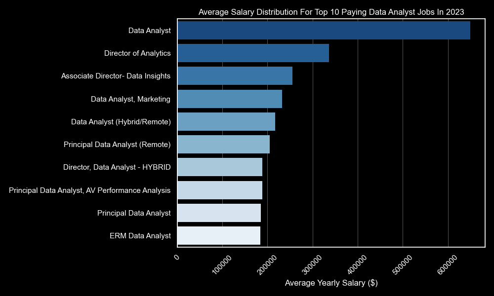
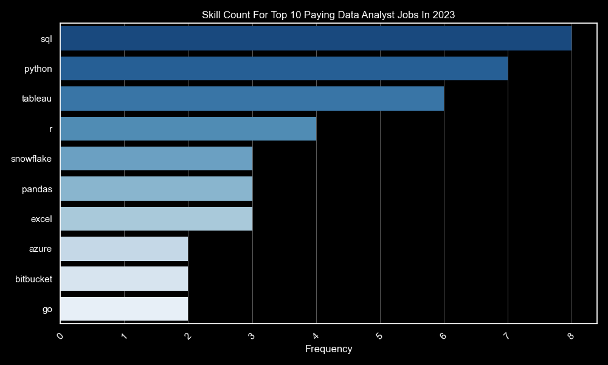

# Introduction

This project aims to explore the landscape of data analyst jobs through SQL queries. By analyzing data from a dataset containing job listings, we delve into the factors influencing job salaries, required skills, and market demand.

> [!IMPORTANT]  
> SQL Queries? Check them out from here: [project_queries](/project_queries/)

# Background

This project emerged from a need to navigate the data analyst job market effectively. Focused on identifying top-paid and in-demand skills, insights into salaries, skill requirements, and market trends, empowering job seekers and employers alike.

### The inquiries are subsequently addressed via my SQL queries were as follows:

1. What are the top-paying data analyst jobs?
2. What skills are required for these top-paying jobs?
3. What skills are most in demand for data analysts?
4. Which skills are associated with higher salaries?
5. What are the most optimal skills to learn?

# Tools

- **SQL**: Structured Query Language forms the backbone of our analysis, allowing us to efficiently query and manipulate datasets.

- **PostgreSQL**: We utilized PostgreSQL as our relational database management system for storing and querying the dataset.

- **Visual Studio Code**: Visual Studio Code served as our primary integrated development environment, providing a user-friendly interface for coding and version control.

- **Git & GitHub**: We employed Git for version control and collaboration, with GitHub serving as our repository hosting platform.

- **Python**: Python scripting was used for additional data visualizing tasks and analysis.

# The Analysis

Each query for this project aimed at investigating specific aspects of the data analyst job market. Here’s how I approached each question:

### 1. Top Paying Data Analyst Jobs

To find the best-paying jobs, I looked at data analyst positions with high yearly salaries and those that are remote. This search shows where the money is in this field.

> [!TIP]  
> Query: [Top Paying Data Analyst Jobs](project_queries/1_top_paying_jobs.sql)

Here's the breakdown of the top data analyst jobs in 2023:

- **Wide Salary Range**: The top 10 paying data analyst roles range from $184,000 to $650,000, showing that there's big money to be made in this field.

- **Diverse Employers**: Companies like SmartAsset, Meta, and AT&T are some of the top payers, indicating that high salaries are available across different industries.

- **Job Title Variety**: There's a lot of job title diversity, from Data Analyst to Director of Analytics, showing the wide range of roles and specialties within data analytics.

_Bar graph visualizing the salary for the top 10 salaries for data analysts; generated by python script for my SQL query results._

### 2. Skills for Top Paying Jobs

To figure out what skills are needed for the best-paying jobs, I combined job postings with skills data. This gives us an idea of what employers consider important for well-paying positions.

> [!TIP]  
> Query: [Top Paying Skills](project_queries/2_top_paying_skills.sql)

Here's the breakdown of the most in-demand skills for the top 10 highest-paying data analyst jobs in 2023:

- **SQL** leads with a strong count of 8.

- **Python** closely follows with a strong count of 7.

- **Tableau** is also highly sought after, with a strong count of 6. Other skills such as **R**, **Snowflake**, **Pandas**, and **Excel** show varying levels of demand.

_Bar graph visualizing the count of skills for the top 10 paying jobs for data analysts; generated by python script for my SQL query results._

### 3. In-Demand Skills for Data Analysts

This query helped pinpoint the skills that are most often requested in job postings, guiding attention to areas where there's a high demand for talent.

> [!TIP]  
> Query: [Top Demanded Skills](project_queries/3_top_demanded_skills.sql)

Here's the breakdown of the most in-demand skills for data analysts in 2023:

- **SQL** and **Excel** continue to be fundamental, highlighting the importance of strong foundational skills in data processing and spreadsheet manipulation.

- **Programming** and **Visualization** Tools such as **Python**, **Tableau**, and **Power BI** are essential, indicating the growing significance of technical skills in data storytelling and decision support.

| Skills     | Demand Count |
| ---------- | :----------: |
| SQL        |    92,628    |
| Excel      |    67,031    |
| Python     |    57,326    |
| Tableau    |    46,554    |
| Power BI   |    39,468    |
| R          |    30,075    |
| SAS        |    28,068    |
| PowerPoint |    13,848    |
| Word       |    13,591    |
| SAP        |    11,297    |

_Table of the demand for the top 10 skills in data analyst job postings_

### 4. Skills Based on Salary

Exploring the average salaries associated with different skills revealed which skills are the highest paying.

> [!TIP]  
> Query: [Top Paying Skills](project_queries/4_top_paying_skills.sql)

Here's a breakdown of the results for top-paying skills for Data Analysts:

- High Demand for Big Data & ML Skills: Analysts skilled in big data technologies like PySpark and Couchbase, machine learning tools such as DataRobot and Jupyter, and Python libraries like Pandas and NumPy command top salaries. This reflects the industry's high valuation of data processing and predictive modeling capabilities.

- Software Development & Deployment Proficiency: Knowledge in development and deployment tools like GitLab, Kubernetes, and Airflow indicates a lucrative crossover between data analysis and engineering. There's a premium on skills that facilitate automation and efficient data pipeline management.

- Cloud Computing Expertise: Familiarity with cloud and data engineering tools such as Elasticsearch, Databricks, and GCP underscores the growing importance of cloud-based analytics environments. Cloud proficiency significantly boosts earning potential in data analytics.

| Skill         | Average Salary ($) |
| ------------- | :----------------: |
| pyspark       |    208,172         |
| Bitbucket     |    189,155         |
| Watson        |    160,515         |
| Couchbase     |    160,515         |
| Datarobot     |    155,486         |
| Gitlab        |    154,500         |
| Swift         |    153,750         |
| Jupyter       |    152,777         |
| Pandas        |    151,821         |
| Elasticsearch |    145,000         |

_Table of the average salary for the top 10 paying skills for data analysts_

### 5. Most Optimal Skills to Learn

Combining insights from demand and salary data, this query aimed to pinpoint skills that are both in high demand and have high salaries, offering a strategic focus for skill development.

> [!TIP]  
> Query: [Optimal Skills](project_queries/5_the_optimal_skills.sql)

| Skills     | Demand Count | Average Salary ($)  |
| ---------- | :----------: | ------------------: |
| Go         |      27      |         115,320     |
| Confluence |      11      |         114,210     |
| Hadoop     |      22      |         113,193     |
| Snowflake  |      37      |         112,948     |
| Azure      |      34      |         111,225     |
| BigQuery   |      13      |         109,654     |
| AWS        |      32      |         108,317     |
| Java       |      17      |         106,906     |
| SSIS       |      12      |         106,683     |
| Jira       |      20      |         104,918     |

_Table of the most optimal skills for data analyst sorted by salary_

Here's a breakdown of the most optimal skills for Data Analysts in 2023:

- **High-Demand Programming Languages**: **Python** and **R** are highly sought after, with demand counts of 236 and 148 respectively. Despite their popularity, their average salaries are around $101,397 for **Python** and $100,499 for **R**, indicating widespread availability of proficiency in these languages.

- **Cloud Tools and Technologies**: Skills in specialized technologies like **Snowflake**, **Azure**, **AWS**, and **BigQuery** show significant demand with relatively high average salaries. This underscores the increasing importance of cloud platforms and big data technologies in data analysis.

- **Business Intelligence and Visualization Tools**: **Tableau** and **Looker**, with demand counts of 230 and 49 respectively, and average salaries around $99,288 and $103,795, emphasize the crucial role of data visualization and business intelligence in deriving actionable insights from data.

- **Database Technologies**: The demand for skills in traditional and **NoSQL** databases such as **Oracle**, **SQL Server**, and **NoSQL**, with average salaries ranging from $97,786 to $104,534, reflects the enduring need for expertise in data storage, retrieval, and management.

# What I Learned

Through this project, I gained insights into the intricacies of the data analyst job market. Not only did I learn to effectively utilize SQL for data analysis, but I also discovered the importance of specific skills in driving job demand and salaries within this field.

# Conclusions

### Insights

From the analysis, several key insights emerged:

1. **Top-Paying Data Analyst Jobs**: Remote data analyst positions offer a wide salary range, with the highest reaching $650,000!

2. **Skills for Top-Paying Jobs**: Proficiency in **SQL** is crucial for earning a top salary in high-paying data analyst roles.

3. **Most In-Demand Skills**: **SQL** remains the most sought-after skill in the data analyst job market, making it essential for job seekers.

4. **Skills with Higher Salaries**: Niche expertise in specialized skills like **SVN** and **Solidity** is associated with the highest average salaries.

5. **Optimal Skills for Job Market Value**: **SQL**, being both in demand and offering a high average salary, is one of the most optimal skills for data analysts to learn to maximize their market value.

### Closing Thoughts

This project has not only enhanced my **SQL** skills but also provided valuable insights into the data analyst job market. The findings serve as a guide for prioritizing skill development and job search efforts. Aspiring data analysts including me can better position themselves in a competitive job market by focusing on high-demand, high-salary skills. This exploration underscores the importance of continuous learning and adaptation to emerging trends in the field of data analytics.
